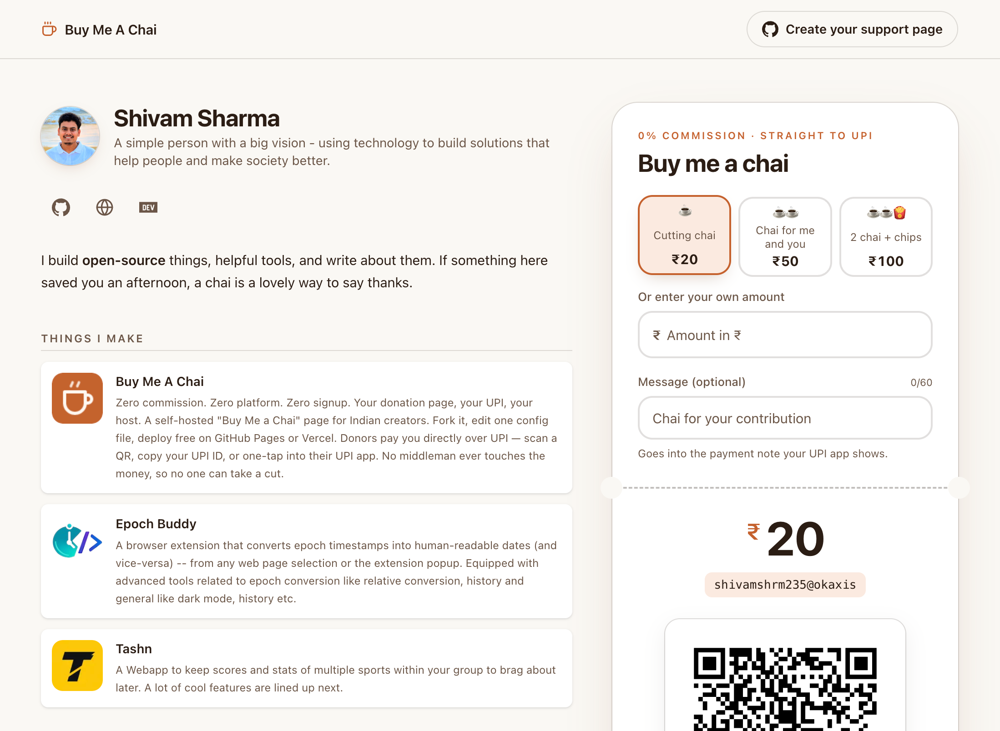

# ☕ buy-me-a-chai

**Zero commission. Zero platform. Zero signup. Your donation page, your UPI, your host.**

A self-hosted "Buy Me a Chai" page for Indian creators. Fork it, edit one config file, deploy free on GitHub Pages or Vercel. Donors pay you **directly** over UPI — scan a QR, copy your UPI ID, or one-tap into their UPI app. No middleman ever touches the money, so no one can take a cut.

> **Why not Buy Me a Coffee / buymeachai.in / chai4.me?** They sit between you and your supporters — commissions, bugs, privacy questions, platform risk. UPI P2P is already free and instant. This project just gives it a beautiful, embeddable face that *you* own.

**🔗 [Live demo](https://shivams136.github.io/buy-me-a-chai/)** — this repo, deployed as-is

## Features

- 🪙 **True 0% fees** — plain UPI P2P (`upi://pay` intents). We can't take a cut of what we never touch.
- ⚡ **Live in ~15 min** — template repo → edit `chai.config.yaml` → push. [Setup guide](docs/SETUP.md).
- 📱 **Works on every device** — live QR (desktop), UPI-app deeplink + Copy-UPI-ID (mobile), honest fallbacks where GPay/PhonePe block browser intents.
- ☕ **Chai-priced presets** — name your own tiers ("Cutting chai · ₹20", "2 chai + chips · ₹100"); donors tap one or enter a custom amount, with a personal message.
- 🧾 **Typed config, loud failures** — Zod-validated; a typo'd UPI ID fails the build, not your donors.
- 📊 **Optional, privacy-first analytics** — off by default, and off means *absent*: a default build contains no tracking code to audit. Turn it on and you get three events, with autocapture and session recording switched off. No donor data, ever.
- 🧩 **Embeddable widget** *(v1, in progress)* — `<chai-widget>` web component for any site.
- 🔓 **MIT licensed, fully static** — no backend, no database, no accounts. Audit every line.

## Quick start

1. **[Use this template](https://github.com/shivams136/buy-me-a-chai/generate)** → create your repo
2. Edit **`chai.config.yaml`** — your name, bio, works, and UPI ID (your editor autocompletes every field)
3. **Settings → Pages → Source: GitHub Actions** — done: `https://<you>.github.io/<repo>/`
4. **Send yourself ₹1** via your live QR before sharing (seriously — [why](docs/SETUP.md#step-5--the-1-self-test-do-not-skip))

Or deploy to Vercel: 

## The honest fine print

- **No payment confirmation.** UPI P2P has no callback API, so the page can't show "payment received" and analytics count *intent*, not income. This limitation is precisely why the whole thing can be free.
- **Deeplinks are best-effort.** GPay/PhonePe restrict browser `upi://` intents to personal UPI IDs; the page detects likely failures and guides donors to QR / Copy-UPI-ID, which work everywhere.
- **Taxes:** gifts from non-relatives above ₹50,000/FY are taxable income in India. [Details](docs/SETUP.md#money--tax-notes-india).

## Who owns what — maker vs creator

Two people are involved in every deployed page, and the code names them consistently so it's always clear which one a value belongs to:

| Name | Who | Where it's set |
|---|---|---|
| **maker** | The author of this template (this repo's owner) | `branding.maker` in [`chai.config.yaml`](chai.config.yaml) — defaults to the author's |
| **project** | This template repository (`buy-me-a-chai`) | `branding.project` in [`chai.config.yaml`](chai.config.yaml) — defaults to this repo |
| **creator** | You — whoever forks and deploys *their own* page | `creator` in [`chai.config.yaml`](chai.config.yaml) |
| **works** | A project the creator lists on their page | `works` in [`chai.config.yaml`](chai.config.yaml) |

**The `branding` block** — the template's two small links, the same on every fork *by default*: the masthead **Create your support page** CTA links to `branding.project.templateUrl` (GitHub's use-this-template flow, so a visitor who likes the page can have their own); the footer **Powered by buy-me-a-chai** links to `branding.project.repoUrl`, and **Support {maker}** to `branding.maker.supportUrl`. All three carry a referral tag (`utm_campaign` = the source project, `utm_source` = the clone's host) so the maker can see clone-driven traffic — no backend, just link params.

**Yours, the creator** — everything else: your name (the `<h1>` and page title), avatar, bio, social links, projects, and, most importantly, **your UPI ID**. Donations go straight to your VPA; they never route through the maker.

To rebrand: override the `branding` block in [`chai.config.yaml`](chai.config.yaml) — no code change. To remove the links entirely: delete them from `Masthead.tsx` / `Footer.tsx`. The code is public — the branding is the only ask of a free project.

## Documentation

| | |
|---|---|
| [SETUP.md](docs/SETUP.md) | Creator guide: fork → config → deploy → self-test |
| [CONFIG.md](docs/CONFIG.md) | Every `chai.config.yaml` field |
| [ANALYTICS.md](docs/ANALYTICS.md) | Event contract + one-command PostHog dashboard setup |
| [PRD.md](docs/PRD.md) | Product requirements & scope |
| [DESIGN.md](docs/DESIGN.md) | UI/UX spec |
| [ARCHITECTURE.md](docs/ARCHITECTURE.md) | Stack & structure |
| [DECISIONS.md](docs/DECISIONS.md) | Why things are the way they are (ADRs) |
| [ROADMAP.md](docs/ROADMAP.md) | v0 → v1 → v2 |
| [CONTRIBUTING.md](CONTRIBUTING.md) | PRs welcome — start here |

## Tech

Vite · React 18 · TypeScript · Tailwind v4 · Zod · client-side `qrcode` · Vitest · GitHub Actions. Pure static output. Built to be read.

## Contributing

Themes, analytics adapters, UPI-app compatibility reports (`docs/COMPAT.md`), i18n — all wanted. One rule above all others: **anything requiring a server or a payment processor is permanently out of scope** ([ADR-001/002](docs/DECISIONS.md)). See [CONTRIBUTING.md](CONTRIBUTING.md).

## License

MIT © [Shivam Sharma](https://github.com/shivams136)

---

*If this project saved you a platform commission, you know exactly what kind of page to thank me on.* ☕
